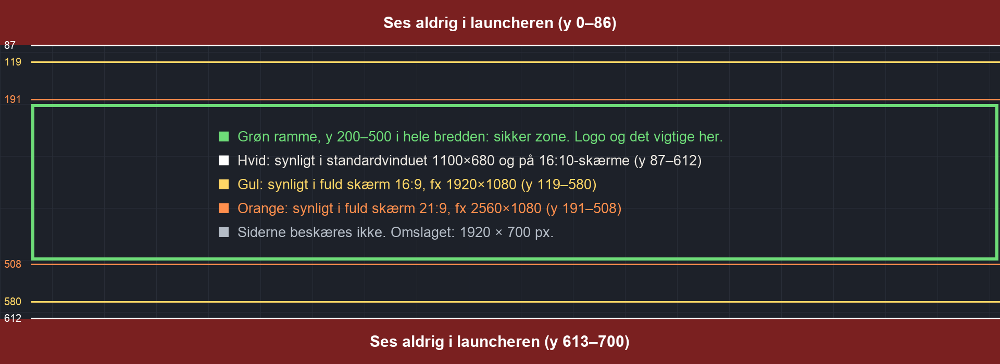

# Grafik til Taktiktavle i MG Games-launcheren

Taktiktavle har brug for to billeder i launcheren: et omslag og et ikon. De nuværende er midlertidige. Jeg lavede
omslaget som HTML (`launcher/omslag.html`), og ikonet er appens eget ikon skaleret ned. Denne fil beskriver, hvad de nye
billeder skal opfylde.

| Fil | Format | Størrelse | Hvor det ses |
| --- | --- | --- | --- |
| `cover.jpg` | JPG (PNG eller WebP går også) | 1920 × 700 px | Det store billede øverst, når Taktiktavle er valgt |
| `icon.png` | PNG, gerne med gennemsigtighed | 256 × 256 px | I spillisten til venstre, vist som 40 × 40 |

Resten af siden er tekst, som launcheren selv viser. Det gælder navnet, slagordet, versionen og noterne.

Viking Legacy og SWAAG bruger samme størrelser: omslag i 1920 × 700 og ikon i 256 × 256.

## Omslaget

### Sådan vises det

Billedet ligger i en boks, der altid er 214 punkter høj. Bredden følger vinduet. Billedet fylder hele boksen, så
launcheren skærer noget af toppen og bunden væk. Siderne skæres ikke væk.

Hvor meget der ses, er målt i launcheren ved fem vinduesstørrelser (3/10):

| Vindue | Boks (punkter) | Synligt af omslaget |
| --- | --- | --- |
| 1100 × 680 (standard), 900 × 560 (mindst), 1440 × 900 (16:10) | 782 × 214 | y 87–612 |
| 1920 × 1080 (fuld skærm 16:9) | 890 × 214 | y 119–580 |
| 2560 × 1080 (fuld skærm 21:9) | 1293 × 214 | y 191–508 |

Det betyder:

- **Sikker zone: y 200–500 i hele bredden.** Logo og det vigtige skal ligge her.
- **De øverste og nederste 87 px ses aldrig.** Lad dem være baggrund, som det fortsætter i, men læg intet vigtigt der.
- Siderne ses altid, så logoet kan godt stå til venstre eller højre.

`omslag_zoner.png` (i samme mappe) er en skabelon i 1920 × 700 med zonerne tegnet ind. Den kan lægges over et udkast.

### Indhold og stil

- **Navnet "Taktiktavle" som logo i billedet.** Launcheren viser også navnet som tekst under billedet. Viking Legacy og
  SWAAG har begge logoet med i omslaget, så Taktiktavle bør også have det. Bogstaverne bør være mindst ca. 120 px høje i
  1920 × 700. I standardvinduet vises billedet i 41 % af den størrelse.
- **Samme niveau som de andre omslag.** Viking Legacy og SWAAG er malede, filmiske scener med et logo, der ser ud af
  metal. Et omslag i flad grafik vil se anderledes ud ved siden af dem.
- **Launcheren er mørk:** baggrund `#101216`, kort `#1d2129` og guldknapper `#e0a93b`. Store hvide flader skærer i øjnene
  ved siden af.
- **Appens udtryk,** hvis billedet skal ligne appen:

  | Farve | Kode |
  | --- | --- |
  | Banegrøn | `#2e7139` og `#296633` |
  | Kanten uden om banen | `#1d4c27` |
  | Mørk baggrund | `#0c120e` |
  | Orange accent | `#ff8f4d` (mørkt tema) og `#c2410c` (lyst tema) |
  | Kridtstreger | hvide |

  Skrifterne er Big Shoulders Display (fed, smal, til overskrifter) og Archivo (til tekst).
- **Forslag til motiver,** i den rækkefølge jeg ville vælge dem:
  1. Et stadion i projektørlys set skråt ovenfra. Taktikken er tegnet på græsset som lysende kridtpile og spillermarkører.
  2. En taktiktavle med magneter i omklædningsrummet. Opstillingen står med magneter, og pilene er tegnet med tusch.
  3. Som i dag: en tegnet bane i perspektiv med spillerbrikker. Det ligner appen mest, men er fladere end de andre
     omslag.
- **Undgå** alt, der er beskyttet, for billedet bliver offentligt i launcheren:
  - rigtige klubmærker,
  - rigtige spillere eller ansigter, man kan genkende,
  - rigtige spilledragter,
  - sponsor- og tøjmærker,
  - stadioner, man kan genkende.

### Fil

Gem omslaget som JPG i præcis 1920 × 700. Hold det gerne under ca. 600 KB, da alle launchere henter det. SWAAG's fylder
267 KB og Viking Legacys 519 KB.

## Ikonet

- **Vises som 40 × 40 punkter** i en liste med mørk baggrund. Rækken er `#161a20`, og den valgte række er `#1d2129` med
  en guldstreg i venstre side. Målt 3/10: 40 × 40 ved alle fem vinduesstørrelser. I fuld skærm 16:9 svarer det til ca.
  64 × 64 pixel på skærmen.
- **Skal kunne læses i 40 × 40:** ét enkelt motiv, kraftig kontrast og ingen tekst. Det nuværende ikon er et godt
  udgangspunkt: en bane, to brikker og en stiplet pil.
- **Kvadratisk, 256 × 256, PNG.** Gennemsigtige hjørner er fine. Viking Legacys ikon har gennemsigtige hjørner, mens
  SWAAG's er et helt fyldt kvadrat. Begge er PNG med alfakanal (RGBA).
- Gerne samme farver og udtryk som omslaget.

Skal det nye ikon også være appens eget ikon på hjemmeskærmen, så send det også i 1024 × 1024. Så laver jeg appens
størrelser ud fra det (`docs/icons/`, som i dag laves af `tools/make_icons.py`).

## Når grafikken er klar

Læg filerne et sted, og sig til. Så gør jeg sådan her:

1. Jeg tjekker størrelse, format og sikker zone. Jeg laver et skærmbillede af launcheren med de nye billeder mod en
   lokal server (`tools/shot.gd`), så du kan se dem i sammenhæng, før noget bliver offentligt.
2. Jeg lægger dem i `~/Claude/MGGamesLauncher/games/taktiktavle/` som `cover.jpg` og `icon.png`.
3. Jeg udgiver med `publish.py`. Den udgiver billederne sammen med en ny build, så det bliver build 2. Har nogen allerede
   installeret Taktiktavle, viser launcheren "Opdatering klar" og knappen "Hent opdatering". Opdateringen er en fil på
   under 1 KB.
4. Jeg lægger det op med `tools/upload_r2.sh`, **kun med dit ok**. Bagefter afprøver jeg det mod den rigtige server med
   `tests/e2e_html.gd`.
